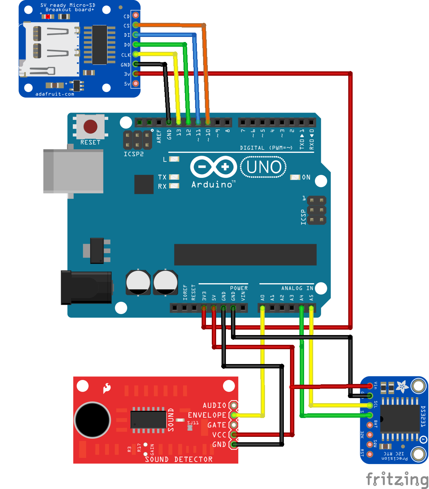

# Sound Detector with Data Logger

----
## TUTORIAL DESCRIPTION

Track signals from a Sparkfun Sound Detector (envelop signals) using an Arduino UNO. 

Log this data into an micro-SD card using a SD-card module, and track time and dates via an RTC module(clock). 

HOW IT WORKS:

**Tutorial 1:** 
As soon as the Arduino is powered, the data logging starts, adding new lines to the same file if re-plugged. 

**Tutorial 2:** Log readings to separate files.

**Tutorial 3:** Add a push button to start/stop data-logging.

----
## SPARKFUN SOUND DETECTOR

The SparkFun Sound Detector is a microphone-based sensor designed to detect the presence and intensity of sound in its surroundings.

*Note : It does NOT provide decibel readings, so it’s not suitable for precise noise level measurements.*

*Note : It’s NOT a sound recorder— It only measures sound intensity (volume) and provides a corresponding signal.*

Read more about the Sparkfun Sound Detector [here](https://github.com/kingston-hackSpace/Sound-Detector/blob/main/README.md)

----
## HARDWARE

- Arduino UNO

- Sparkfun Sound detector

- SD-card module (with SD-card and reader) [more detail here](https://github.com/kingston-hackSpace/SDCard)
  
- RTC clock module with a 3V battery cell[more detail here](https://github.com/kingston-hackSpace/RTC_Clock-Module)

- jumper wires

----
## WIRING : ARDUINO UNO

*Note: Click on the image to expand 

---
## WIRING : ARDUINO MEGA

If using an Arduino Mega, re-wire as follows:

- SDCARD MODULE 5V pin to the 5V pin on the Arduino UNO

- SDCARD MODULE GND pin to the GND pin on the Arduino UNO

- SDCARD MODULE CLK to pin 13  (pin 52 for Arduino MEGA)

- SDCARD MODULE DO to pin 12 (pin 50 for Arduino MEGA)

- SDCARD MODULE DI to pin 11  (pin 51 for Arduino MEGA)

- SDCARD MODULE CS to pin 10  (pin 53 for Arduino MEGA)

----
### INSTALLING LIBRARIES

- Open Arduino IDE

- At the top of your Arduino IDE, go to **Sketch > Include library > Manage libraries...**

- You will see a new panel at the left side of your Arduino IDE

- Using the search box, search and install the following libraries:
  
  - **RTClib** by Adafruit

  - **SD** by Arduino, Sparkfun

- Done! You don't need to repeat this again. 

----
### TUTORIAL 1

- If starting from scratch, begin by erasing any files that you micro-SD card may have.

- Insert the micro-SD card into your SD card module

- Upload [this code](https://github.com/kingston-hackSpace/Making-a-sound-detector-with-data-logger/blob/main/SoundDetect_simpleLog.ino) to your Arduino board.

- Open the Serial Monitor to visualize readings at real-time.

----
### TUTORIAL 2

Log readings to separate files: everytime you re-plug the Arduino board, new data loggins will be recorded on a new .CSV file

----
### TUTORIAL 3

Add a push button to start/stop data-logging.

----
### TROUBLESHOOTING

If your date is not updates try the following...

- replace the 3V battery cell in used by the RCT module, then upload the code again. 

If the SD card is not reading try the following...

- ensure the SD card is formatted correctly

- use only 8 characters for the name of the destination file

- make sure the jump leads are well connected

- try replacing the breadboard

----
### Useful links

[More on data logging](https://github.com/kingston-hackSpace/DataLogging_DHT11/tree/main)

